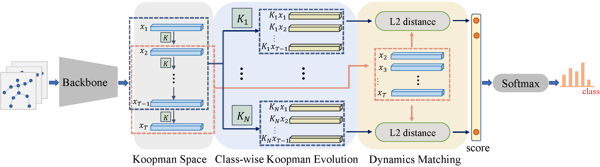

# Neural Koopman Pooling
This repo is the official implementation for the paper "Neural Koopman Pooling: Control-Inspired Temporal Dynamics Encoding for Skeleton-Based Action Recognition", CVPR 2023.



# Prerequisites

- Python >= 3.8
- PyTorch >= 1.10.1
- Run `pip install -e torchlight` 
- Run `pip install -r requirements.txt`

## Data Preparation

### Download datasets.

#### There are 3 datasets to download:

- NTU RGB+D 60 Skeleton
- NTU RGB+D 120 Skeleton
- NW-UCLA

#### NTU RGB+D 60 and 120

1. Request dataset here: https://rose1.ntu.edu.sg/dataset/actionRecognition
2. Download the skeleton-only datasets:
   1. `nturgbd_skeletons_s001_to_s017.zip` (NTU RGB+D 60)
   2. `nturgbd_skeletons_s018_to_s032.zip` (NTU RGB+D 120)
   3. Extract above files to `./data/nturgbd_raw`

#### NW-UCLA

1. Download dataset from [https://www.dropbox.com/s/10pcm4pksjy6mkq/all_sqe.zip?dl=0](https://www.dropbox.com/s/10pcm4pksjy6mkq/all_sqe.zip?dl=0).
2. Move `all_sqe` to `./data/NW-UCLA`

### Data Processing

#### Directory Structure

Put downloaded data into the following directory structure:

```
- data/
  - NW-UCLA/
    - all_sqe
      ... # raw data of NW-UCLA
  - ntu/
  - ntu120/
  - nturgbd_raw/
    - nturgb+d_skeletons/     # from `nturgbd_skeletons_s001_to_s017.zip`
      ...
    - nturgb+d_skeletons120/  # from `nturgbd_skeletons_s018_to_s032.zip`
      ...
```

#### Generating Data

- Generate NTU RGB+D 60 or NTU RGB+D 120 dataset:

```
 cd ./data/ntu # or cd ./data/ntu120
 # Get skeleton of each performer
 python get_raw_skes_data.py
 # Remove the bad skeleton 
 python get_raw_denoised_data.py
 # Transform the skeleton to the center of the first frame and vertically align to the ground
 python seq_transformation.py
```


# Training & Testing

### Training

- Change the config file depending on what you want.
```
# First stage
- CUDA_VISIBLE_DEVICES=0,1,2,3 python -m torch.distributed.launch --nproc_per_node=4 --master_addr=127.0.0.1 --master_port=<port> python main_multigpu.py --config <config_path>/koopman.yaml
# Eigenvalue normalization
- python eigen_normalization.py --load-path <work_dir>/runs-xx-xxxxx.pt --save-path <work_dir>/normalized_runs-xx-xxxxx.pt --num-class <num_class>
# Second stage
- CUDA_VISIBLE_DEVICES=0,1,2,3 python -m torch.distributed.launch --nproc_per_node=4 --master_addr=127.0.0.1 --master_port=<port> python main_multigpu.py --config <config_path>/tune.yaml --weights <work_dir>/normalized_runs-xx-xxxxx.pt


# Example: train model on NTU RGB+D 120 cross subject
- CUDA_VISIBLE_DEVICES=0,1,2,3 python -m torch.distributed.launch --nproc_per_node=4 --master_addr=127.0.0.1 --master_port=29501 main_multigpu.py --config config/nturgbd120-cross-subject/koopman.yaml
- python eigen_normalization.py --load-path ./work_dir/ntu120/xsub/koopman_joint/runs-xx-xxxxx.pt --save-path ./work_dir/ntu120/xsub/koopman_joint/normalized_runs-xx-xxxxx.pt --num-class 120
- CUDA_VISIBLE_DEVICES=0,1,2,3 python -m torch.distributed.launch --nproc_per_node=4 --master_addr=127.0.0.1 --master_port=29501 main_multigpu.py --config config/nturgbd120-cross-subject/tune.yaml --weights ./work_dir/ntu120/xsub/koopman_joint/normalized_runs-xx-xxxxx.pt
```

- To train model on NTU RGB+D 60/120 with bone or motion modalities, set `bone` or `vel` arguments in the config file `koopman.yaml`.

- To train model on NW-UCLA with bone or motion modalities, modify `data_path` in `train_feeder_args` and `test_feeder_args` to "bone" or "motion" or "bone motion".


### Testing

- To test the trained models, run the following command:
```
CUDA_VISIBLE_DEVICES=0,1,2,3 python -m torch.distributed.launch --nproc_per_node=4 --master_addr=127.0.0.1 --master_port=<port> main_multigpu.py --config <work_dir>/koopman.yaml --work-dir <work_dir> --phase test --save-score True --weights <work_dir>/xxx.pt
```

- To obtain overall results by ensembling original CTR-GCN score and Koopman score, run 
```
# Example: obtain overall results on NTU RGB+D 120 cross subject
- python ensemble.py --datasets ntu120/xsub --joint-dir1 work_dir/ntu120/csub/Koopman_joint --bone-dir1 work_dir/ntu120/csub/Koopman_bone --joint-motion-dir1 work_dir/ntu120/csub/Koopman_joint_motion --bone-motion-dir1 work_dir/ntu120/csub/Koopman_bone_motion --joint-dir2 work_dir/ntu120/csub/ctrgcn_joint --bone-dir2 work_dir/ntu120/csub/ctrgcn_bone --joint-motion-dir2 work_dir/ntu120/csub/ctrgcn_joint_motion --bone-motion-dir2 work_dir/ntu120/csub/ctrgcn_bone_motion
```
where ``Koopman_joint, Koopman_bone, Koopman_joint_motion, Koopman_bone_motion`` contains scores of Koopman method and ``ctrgcn_joint, ctrgcn_bone, ctrgcn_joint_motion, ctrgcn_bone_motion`` contains scores of original CTR-GCN method.

# Oneshot Training & Testing

### Data
The evaluation set contains 20 novel classes(namely A1, A7, A13, ..., A115), and the auxiliary set contains all sequences from 100 other classes. 
One sample from the evaluation set is selected as the exemplar. Details can be found in [NTU RGB+D120](https://github.com/shahroudy/NTURGB-D). We provide the pre-processed [dataset](https://pan.baidu.com/s/1Kkw0F1x9Pk5U3RwUEwYBCg?pwd=6r51).
After downloading, put the files under ``./data/ntu120/oneshot/``.

### Training
To train model under oneshot setting on NTU RGB+D 120, run the following command:
```
CUDA_VISIBLE_DEVICES=0,1,2,3 python -m torch.distributed.launch --nproc_per_node=4 --master_addr=127.0.0.1 --master_port=<port> main_multigpu.py --config ./config/nturgbd120-oneshot/koopman_oneshot.yaml
```

### Testing
To test the trained model under oneshot setting, run the following command:
```
python test_oneshot.py --config config/nturgbd120-oneshot/koopman_oneshot_test.yaml --weights ./work_dir/oneshot/ntu120/xsub/koopman_joint/runs-xx-xxxxx.pt
```

# Acknowledgements
This repo is based on [CTR-GCN](https://github.com/Uason-Chen/CTR-GCN).

# Citation

Please cite this work if you find it useful:.

    @InProceedings{Wang_2023_CVPR,
    author    = {Wang, Xinghan and Xu, Xin and Mu, Yadong},
    title     = {Neural Koopman Pooling: Control-Inspired Temporal Dynamics Encoding for Skeleton-Based Action Recognition},
    booktitle = {Proceedings of the IEEE/CVF Conference on Computer Vision and Pattern Recognition (CVPR)},
    month     = {June},
    year      = {2023},
    pages     = {10597-10607}
}
